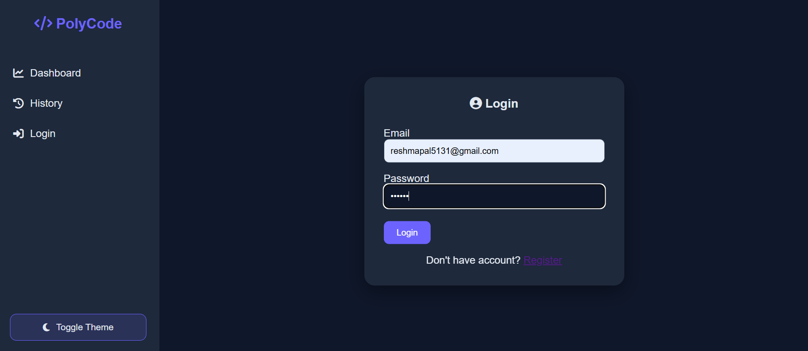
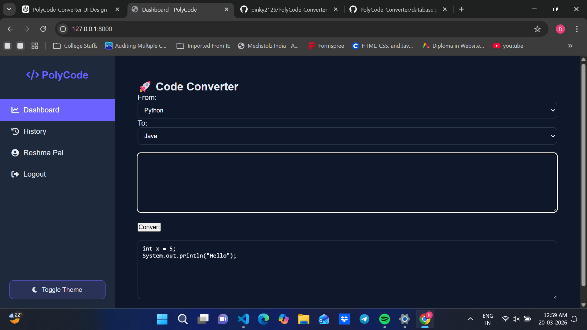
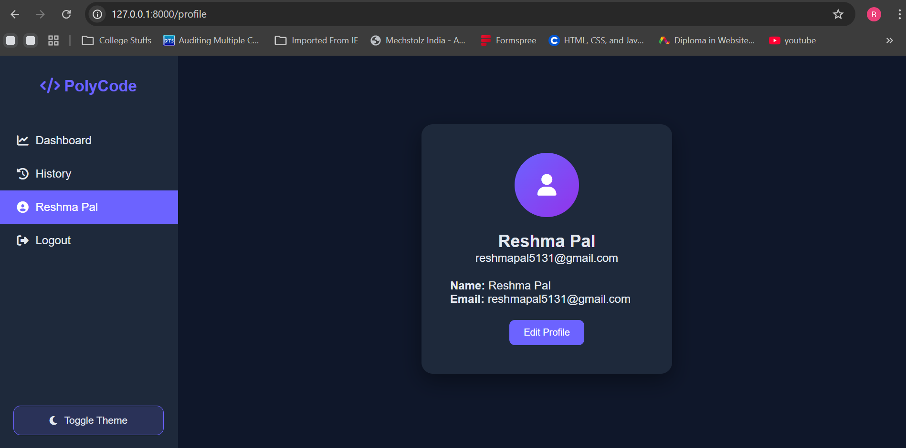

# 🚀 PolyCode Converter

A multi-language code converter web application built using Flask.  
It allows users to convert code between Python, Java, and C.

---

## ✨ Features

- 🔄 Convert code between:
  - Python ↔ Java
  - Python ↔ C
  - Java ↔ C
- 🔐 User Authentication (Login & Register)
- 🕘 Conversion History tracking
- 👤 Profile Management (Edit profile)
- 🌙 Dark & Light Mode UI
- 💻 Clean and modern dashboard

---

## 🛠️ Tech Stack

- **Frontend:** HTML, CSS, JavaScript  
- **Backend:** Python (Flask)  
- **Database:** SQLite  
- **Version Control:** Git & GitHub  

---

## 📸 Screenshots

### 🔐 Login Page


### 💻 Dashboard (Code Conversion)


### 👤 Profile Page


---

## ⚙️ How to Run Locally

```bash
git clone https://github.com/YOUR_USERNAME/PolyCode-Converter.git
cd PolyCode-Converter
pip install -r requirements.txt
python app.py